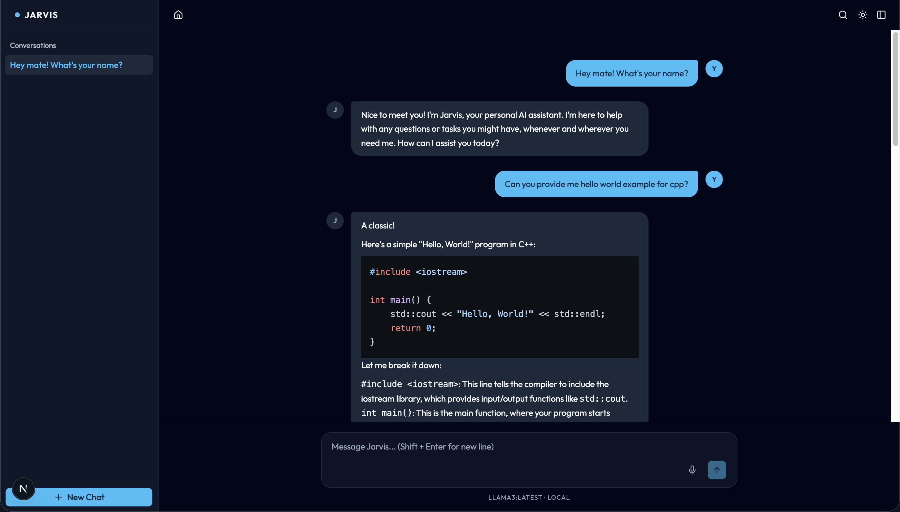

# Iskra

A local AI assistant powered by [Ollama](https://ollama.com).
Runs entirely on your machine — no cloud, no API keys, no data leaving your device.



## Requirements

- [Node.js](https://nodejs.org)
- [Ollama](https://ollama.com) running locally with at least one model

```bash
ollama pull llama3
```

## Getting Started

```bash
git clone https://github.com/mmilanovic4/iskra
cd iskra
npm install
npm run dev
```

Open [http://localhost:6789](http://localhost:6789).

## Features

- Chat with any locally installed Ollama model
- Persistent conversation history (SQLite)
- Model switching per conversation
- Voice input via Web Speech API
- Markdown rendering with syntax highlighting
- Fully offline after setup

## Stack

- Next.js
- Tailwind CSS + shadcn/ui
- SQLite (better-sqlite3)
- Ollama
